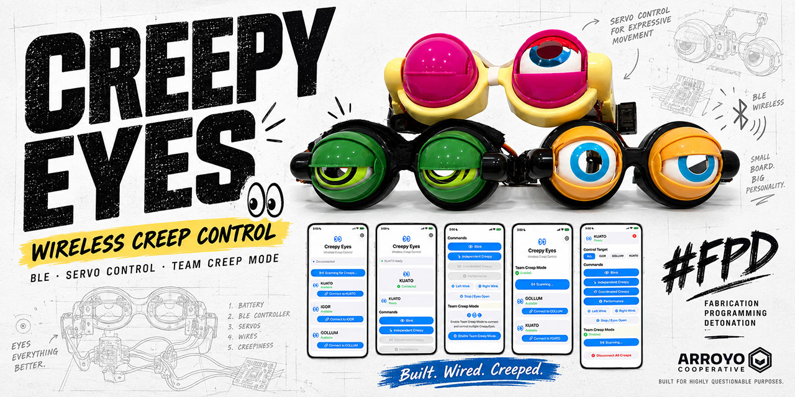
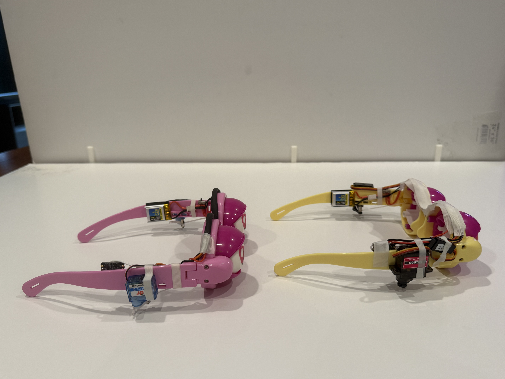
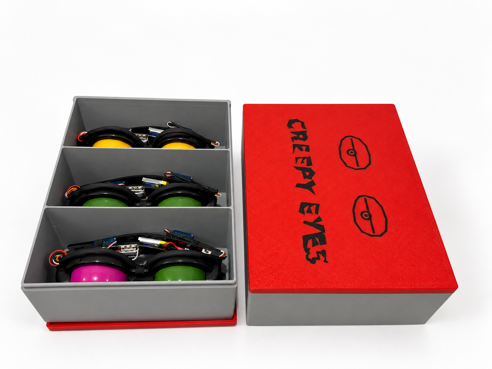

# CreepyEyes



Native iPhone BLE control for servo-driven **Creepy Eyes** glasses.

Built by Arroyo Cooperative for highly questionable purposes. 👀

CreepyEyes combines:

- a native SwiftUI iPhone app
- BLE-connected Seeed Studio XIAO ESP32-C3 controllers
- independently servo-driven eyelids
- per-creep calibration
- single-device and multi-device control
- synchronized pseudo-random movement
- app-orchestrated Performance mode
- a compact wearable hardware build

## Current status

The app is functionally complete through **V3 Team Creep Mode**.

Named Creeps:

- `KUATO`
- `IGOR`
- `GOLLUM`
- `FESTER`
- `LURCH`

The fleet is being standardized on the newer compact hardware architecture documented in [hardware/README.md](hardware/README.md): smaller sub-micro servos, direct-solder servo wiring, formed heat-shrink loom, and the improved ball-bearing linkage clamp.

The compact hardware revision is a substantial packaging cleanup over the original build:



Additional comparison views are available in [`docs/images/evolution/`](docs/images/evolution/), and a short fleet demo is in [`CreepsInMotion.mp4`](docs/images/media/CreepsInMotion.mp4).

## What the app does

The iPhone app:

- scans for nearby CreepyEyes devices
- connects securely over BLE
- displays each creep by its advertised name
- controls one creep by default
- enables multi-device control through **Team Creep Mode**
- stores motion settings locally on the iPhone
- routes commands to one creep or the whole connected fleet
- generates shared seeds for Coordinated Creepy behavior
- orchestrates Performance mode
- safely stops Creeps before disconnecting

Supported behaviors:

- **Blink**
- **Left Wink**
- **Right Wink**
- **Independent Creepy**
- **Coordinated Creepy**
- **Performance**
- **Stop / Eyes Open**

## Team Creep Mode

The app intentionally starts as a simple single-Creep controller.

After one Creep is connected, the user can explicitly enable **Team Creep Mode** for that app session. That reveals `Scan for More Creeps` and allows multiple hardware units to be connected.

With multiple Creeps connected, the app can target:

- `ALL`
- any individual connected creep

Fleet-only behaviors such as Coordinated Creepy and Performance become available when multiple Creeps are connected and `ALL` is selected.

Team Creep Mode is session-only and does not use a password, subscription, license key, or in-app purchase.

## Independent Creepy

Each creep generates its own random movement sequence and speed range, producing intentionally uncoordinated motion across the fleet.

## Coordinated Creepy

The iPhone generates one random seed and sends the same seed and behavior parameters to participating Creeps.

The firmware uses a deterministic pseudo-random generator, so Creeps receiving the same seed follow the same action/speed sequence.

## Performance mode

Performance is orchestrated by the iPhone app rather than hard-coded into the firmware.

Default sequence:

```text
Left Wink
→ Right Wink
→ Blink
→ Independent Creepy
→ Coordinated Creepy
```

The first four phases use the configurable Performance duration. Coordinated Creepy remains active until another command is sent.

`Stop / Eyes Open` interrupts the sequence immediately.

## Factory defaults

```text
Wink Interval               3.0 sec
Wink Speed                  1.0x
Blink Interval              3.0 sec
Blink Speed                 1.0x
Creepy Transition Interval  1.0 sec
Creepy Minimum Speed        0.5x
Creepy Maximum Speed        1.5x
Performance Action Duration 10 sec
```

## BLE protocol

Service UUID:

```text
4fafc201-1fb5-459e-8fcc-c5c9c331914b
```

Characteristic UUID:

```text
beb5483e-36e1-4688-b7f5-ea07361b26a8
```

Commands:

```text
L:<speed>
R:<speed>
B:<transition interval>:<speed>
I:<transition interval>:<minimum speed>:<maximum speed>
C:<transition interval>:<minimum speed>:<maximum speed>:<seed>
S
```

Where:

- `L` = one Left Wink
- `R` = one Right Wink
- `B` = repeating Blink
- `I` = Independent Creepy
- `C` = Coordinated Creepy
- `S` = Stop / Eyes Open

## Hardware orientation convention

**LEFT and RIGHT are defined from the wearer's perspective.**

```text
D4 = wearer's LEFT eye
D5 = wearer's RIGHT eye
```

This convention is used in current firmware, calibration, wiring, and build documentation.

## Hardware build

The current preferred hardware build is documented here:

- [Hardware build guide](hardware/README.md)
- [BOM and tools](hardware/BOM.md)
- [Textual wiring reference](hardware/WIRING.md)

The repository also includes the glasses assembly/calibration fixture and the current 3-slot sliding-lid travel/storage case:

```text
stl-bambu-3mf/
├── creepy-glass-holder.3mf
├── creepy-glass-holder.stl
├── CreepyEyes-3Slot-Box.3mf
├── CreepyEyes_3Slot_Box_BASE_70mm.stl
├── CreepyEyes_3Slot_Box_LID_70mm.stl
├── CreepyEyes_Lid_Overlay_NORMAL.svg
└── CreepyEyes_Lid_Overlay_MIRRORED.svg
```

The case holds three folded Creeps in separate bays and uses the CreepyEyes SVG as a merged lid overlay:



## Firmware

The firmware lives under:

```text
firmware/
├── README.md
├── CreepyEyes/
│   ├── CreepyEyes.ino
│   └── secrets.example.h
└── CreepyEyesCalibration/
    └── CreepyEyesCalibration.ino
```

See [firmware/README.md](firmware/README.md) for Arduino setup, calibration, flashing, BLE protocol, and local secrets.

## Local secrets

Production firmware uses a local `secrets.h`:

```cpp
#pragma once
#define CREEP_NAME "KUATO"
#define FLEET_PASSCODE 123456
```

The real fleet passcode must remain local. `secrets.h` is excluded by `.gitignore`; only `secrets.example.h` belongs in source control.

## iPhone app architecture

### `BLEManager.swift`

Owns scanning, connections, characteristic discovery, per-device command channels, command transmission, safe disconnect, and multi-creep BLE state.

### `ContentView.swift`

Owns UI and orchestration: Team Creep Mode, target selection, motion settings, Performance sequencing, and Coordinated Creepy seed generation.

The app sends semantic behavior commands rather than raw servo positions.

## Design philosophy

Firmware owns:

- servo positions and calibration
- motion timing and interpolation
- blink/wink/Creepy behaviors
- safe stop behavior

The iPhone app owns:

- user settings
- connection/target selection
- Team Creep Mode
- fleet orchestration
- Performance sequencing
- coordinated seed generation

## License and disclaimer

See [LICENSE](LICENSE) and [DISCLAIMER.md](DISCLAIMER.md).

CreepyEyes is a hobbyist wearable-electronics project involving LiPo batteries, custom wiring, moving mechanisms, and modified novelty glasses. Build and use it accordingly.
